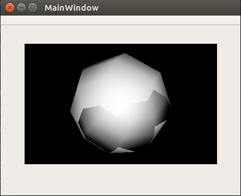
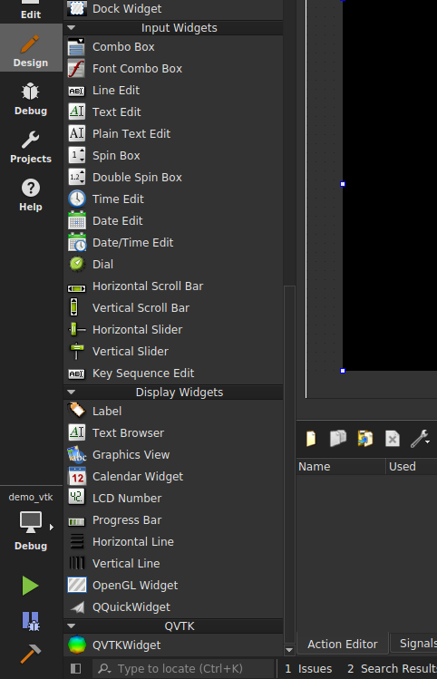

# demo_vtk_and_qt
Demo how to use VTK 7.x in Qt 5.7  
因为这两个版本都比较新，官方的文档零散，所以整理出来，环境 Ubuntu 14.04。

示例： 在Qt中使用VTK渲染一个球体  
  

## 步骤
1.下载安装 Qt 5.7 完整安装包，会连同 Qt Creator 一起安装。 

2.下载 VTK 7.1 源码。编译配置，默认 VTK 只打开对 Qt 4 的编译，而我们是对 Qt 5.x 的编译，所以关键是要指定 Qt 的安装位置以打开对 Qt 的支持.
```
cmake -DVTK_QT_VERSION:STRING=5 \
     -DQT_QMAKE_EXECUTABLE:PATH=/path/to/Qt/5.7/gcc_64/bin/qmake \
     -DVTK_Group_Qt:BOOL=ON \
     -DCMAKE_PREFIX_PATH:PATH=/path/to/Qt/5.7/gcc_64/lib/cmake  \
     -DBUILD_SHARED_LIBS:BOOL=ON \
     -DCMAKE_BUILD_TYPE=Debug
     /path/to/VTK
make -j 7
sudo make install
sudo ldconfig // 更新系统的动态库
```
cmake 配置时可以结合 ccmake 这个图形化界面，直观地了解配置了什么。  
参考 VTK 官方文档：http://www.vtk.org/Wiki/VTK/Configure_and_Build#Qt_4.8..2A  

3.为了能在 Qt Creator 的 Designer 中使用 QVTKWidget，需要将编译出的 Qt Designer 的插件复制至对应目录下。  
这里分两种情况，一种是 Qt Designer 独立使用的，一种是内嵌在 Qt Creator 中的 Qt Designer。  
Honhe 在这里使用的是内嵌在 Qt Creator 中的 Qt Designer，因此操作如下：
```
cp VKT-7.1.0_build/lib/libQVTKWidgetPlugin.so /Qt/Tools/QtCreator/bin/designer/
```
可能`bin/designer/`这个目录不存在，自己建一个就OK，这时再打开 Qt Creator 中 Designer 就可以看到 QVTKWidget。

    

参考 Qt 官方文档：http://doc.qt.io/qtcreator/adding-plugins.html Locating Qt Designer Plugins 这一节。
VTK 的文档有点过时了: http://www.vtk.org/Wiki/VTK/Tutorials/QtSetup  

4.这时直接在 Qt Creator 中开发编译 VTK 会提示找不到头文件，以及 ld 链接出错，解决方法是在项目的 .pro 文件中加入查找位置。  
Honhe机子上的 VTK 的动态链接库的的安装位置为 `/usr/local/lib`，因为不清楚具体依赖，就把 VTK 的 so 都加了进来，有知道如何简化的方法欢迎读者提 issue 或 PR。  
```
INCLUDEPATH +=/usr/local/include/vtk-7.1

LIBS += -L/usr/local/lib \
-lvtkalglib-7.1 \
-lvtkChartsCore-7.1 \
-lvtkCommonColor-7.1 \
-lvtkCommonComputationalGeometry-7.1 \
-lvtkCommonCore-7.1 \
-lvtkCommonDataModel-7.1 \
-lvtkCommonExecutionModel-7.1 \
-lvtkCommonMath-7.1 \
-lvtkCommonMisc-7.1 \
-lvtkCommonSystem-7.1 \
-lvtkCommonTransforms-7.1 \
-lvtkDICOMParser-7.1 \
-lvtkDomainsChemistry-7.1 \
-lvtkDomainsChemistryOpenGL2-7.1 \
-lvtkexoIIc-7.1 \
-lvtkexpat-7.1 \
-lvtkFiltersAMR-7.1 \
-lvtkFiltersCore-7.1 \
-lvtkFiltersExtraction-7.1 \
-lvtkFiltersFlowPaths-7.1 \
-lvtkFiltersGeneral-7.1 \
-lvtkFiltersGeneric-7.1 \
-lvtkFiltersGeometry-7.1 \
-lvtkFiltersHybrid-7.1 \
-lvtkFiltersHyperTree-7.1 \
-lvtkFiltersImaging-7.1 \
-lvtkFiltersModeling-7.1 \
-lvtkFiltersParallel-7.1 \
-lvtkFiltersParallelImaging-7.1 \
-lvtkFiltersPoints-7.1 \
-lvtkFiltersProgrammable-7.1 \
-lvtkFiltersSelection-7.1 \
-lvtkFiltersSMP-7.1 \
-lvtkFiltersSources-7.1 \
-lvtkFiltersStatistics-7.1 \
-lvtkFiltersTexture-7.1 \
-lvtkFiltersVerdict-7.1 \
-lvtkfreetype-7.1 \
-lvtkGeovisCore-7.1 \
-lvtkgl2ps-7.1 \
-lvtkglew-7.1 \
-lvtkGUISupportQt-7.1 \
-lvtkGUISupportQtSQL-7.1 \
-lvtkhdf5-7.1 \
-lvtkhdf5_hl-7.1 \
-lvtkImagingColor-7.1 \
-lvtkImagingCore-7.1 \
-lvtkImagingFourier-7.1 \
-lvtkImagingGeneral-7.1 \
-lvtkImagingHybrid-7.1 \
-lvtkImagingMath-7.1 \
-lvtkImagingMorphological-7.1 \
-lvtkImagingSources-7.1 \
-lvtkImagingStatistics-7.1 \
-lvtkImagingStencil-7.1 \
-lvtkInfovisCore-7.1 \
-lvtkInfovisLayout-7.1 \
-lvtkInteractionImage-7.1 \
-lvtkInteractionStyle-7.1 \
-lvtkInteractionWidgets-7.1 \
-lvtkIOAMR-7.1 \
-lvtkIOCore-7.1 \
-lvtkIOEnSight-7.1 \
-lvtkIOExodus-7.1 \
-lvtkIOExport-7.1 \
-lvtkIOGeometry-7.1 \
-lvtkIOImage-7.1 \
-lvtkIOImport-7.1 \
-lvtkIOInfovis-7.1 \
-lvtkIOLegacy-7.1 \
-lvtkIOLSDyna-7.1 \
-lvtkIOMINC-7.1 \
-lvtkIOMovie-7.1 \
-lvtkIONetCDF-7.1 \
-lvtkIOParallel-7.1 \
-lvtkIOParallelXML-7.1 \
-lvtkIOPLY-7.1 \
-lvtkIOSQL-7.1 \
-lvtkIOTecplotTable-7.1 \
-lvtkIOVideo-7.1 \
-lvtkIOXML-7.1 \
-lvtkIOXMLParser-7.1 \
-lvtkjpeg-7.1 \
-lvtkjsoncpp-7.1 \
-lvtklibxml2-7.1 \
-lvtkmetaio-7.1 \
-lvtkNetCDF-7.1 \
-lvtkNetCDF_cxx-7.1 \
-lvtkoggtheora-7.1 \
-lvtkParallelCore-7.1 \
-lvtkpng-7.1 \
-lvtkproj4-7.1 \
-lvtkRenderingAnnotation-7.1 \
-lvtkRenderingContext2D-7.1 \
-lvtkRenderingContextOpenGL2-7.1 \
-lvtkRenderingCore-7.1 \
-lvtkRenderingFreeType-7.1 \
-lvtkRenderingGL2PSOpenGL2-7.1 \
-lvtkRenderingImage-7.1 \
-lvtkRenderingLabel-7.1 \
-lvtkRenderingLOD-7.1 \
-lvtkRenderingOpenGL2-7.1 \
-lvtkRenderingQt-7.1 \
-lvtkRenderingVolume-7.1 \
-lvtkRenderingVolumeOpenGL2-7.1 \
-lvtksqlite-7.1 \
-lvtksys-7.1 \
-lvtktiff-7.1 \
-lvtkverdict-7.1 \
-lvtkViewsContext2D-7.1 \
-lvtkViewsCore-7.1 \
-lvtkViewsInfovis-7.1 \
-lvtkViewsQt-7.1 \
-lvtkzlib-7.1 \
```
